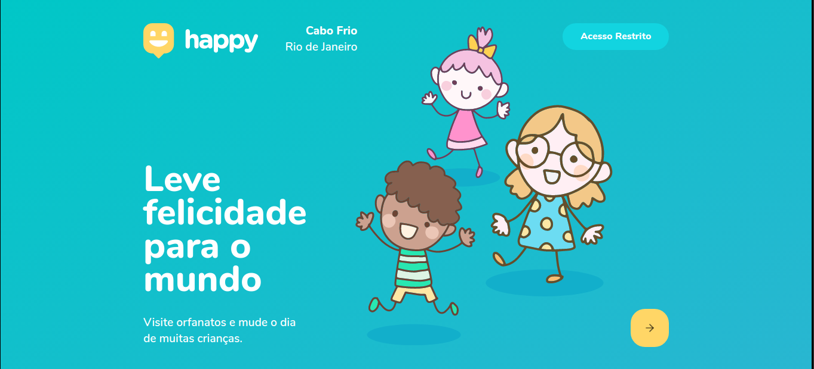
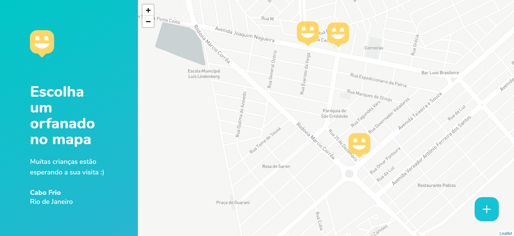
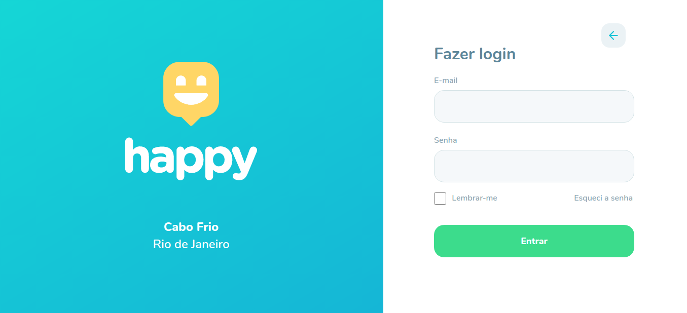
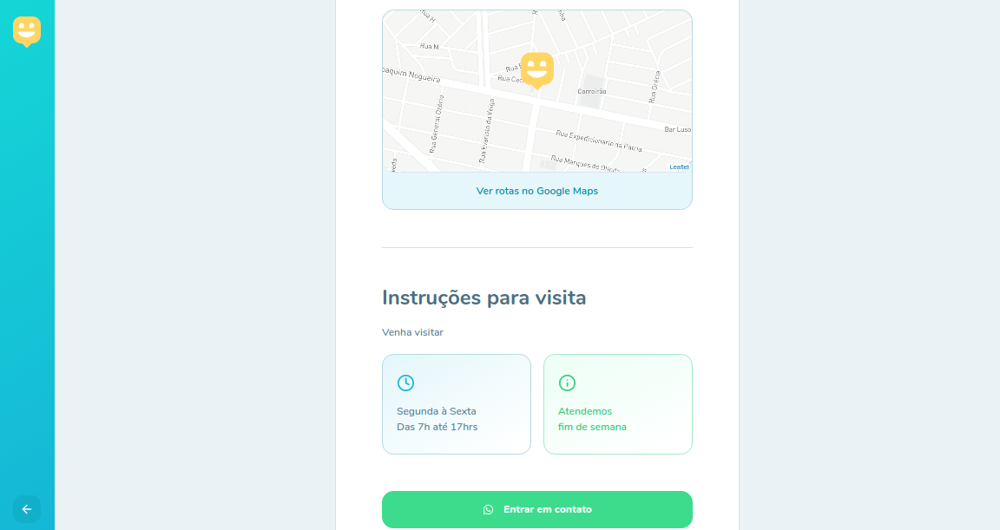
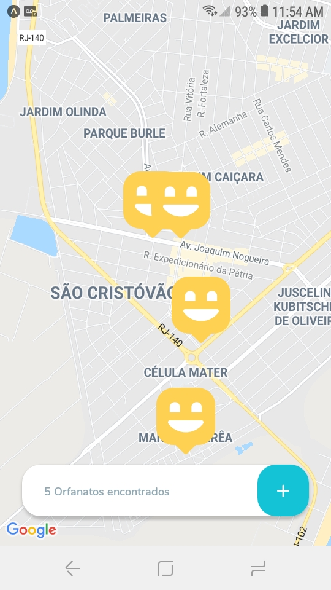
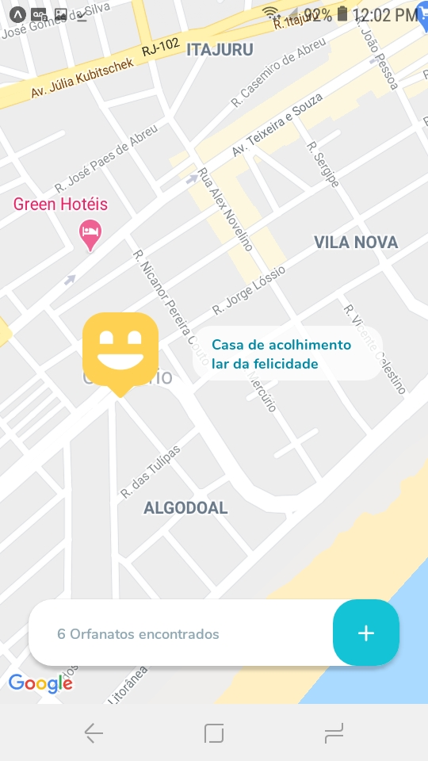
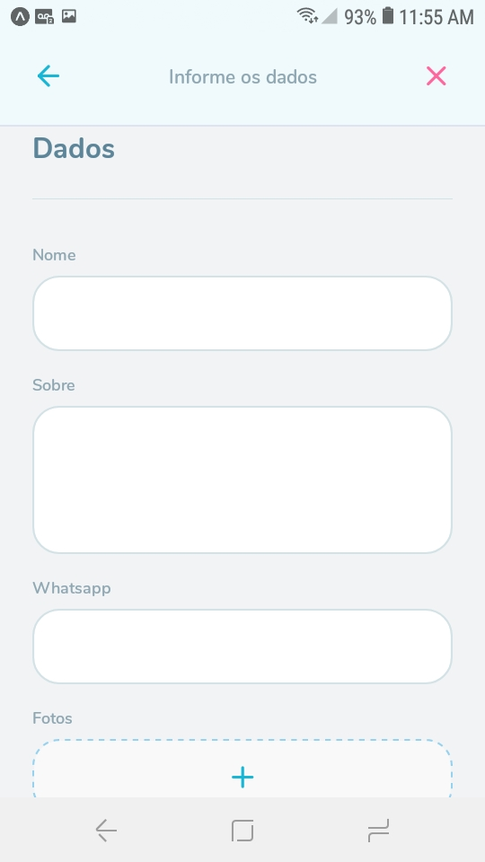
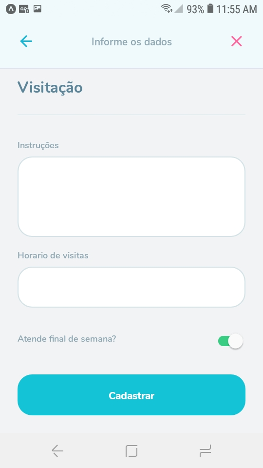
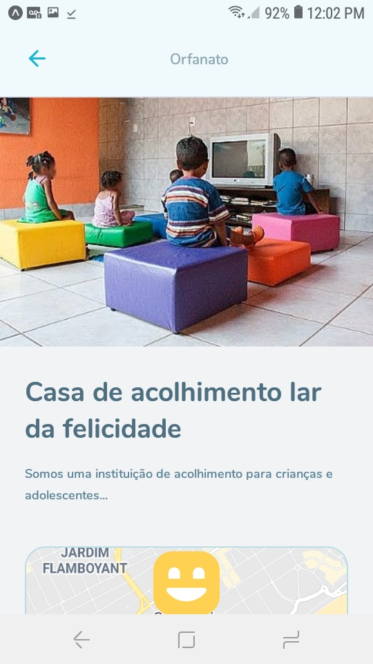
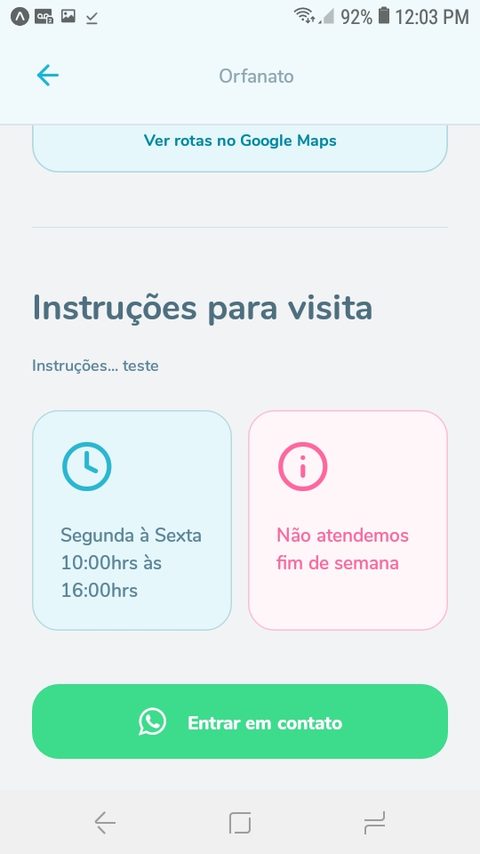

# Happy

<h1 align="center" >
  
</h1>

## 💻 Projeto

Happy é uma aplicação desenvolvida em comemoração ao dia das crianças, com ela conseguimos conectar diversas casas de acolhimento institucional, realizando agendamentos de visitas para pessoas que querem fazer o dia dessas crianças mais felizes levando amor, esperança e alegria 💜

<h4 align="center"> 
	🚧 Versão 2.0 em desenvolvimento 🚧
</h4>

<h2 id="tecnologias"> 🚀 Tecnologias </h2>

Esse projeto foi desenvolvido com as seguintes tecnologias:

- [Node.js](https://nodejs.org/en/)
- [React](https://reactjs.org)
- [React Native](https://facebook.github.io/react-native/)
- [Expo](https://expo.io/)
- [TypeScript](https://www.typescriptlang.org/)

---

## 🎨 Layout


### Web

<p>
  
  
  
  
</p>

### Mobile

<p>
  
  
  
  
  
   
</p>

---

<h2 id="features-implementadas"> 🚧 Features implementadas da Versão 2.0 </h2>

#### Web

- Pagina de sucesso ao realizar o cadastro de novo orfanato
- Pagina de login
- Integração com a API do whatsapp

- Em construção...

#### Mobile

- Integração com a API do whatsapp

- Em construção...

---

## 🍃 Rotas

- Servidor http://localhost:3333
- Web http://localhost:3000
- Mobile(expo) http://localhost:19000

---

## 💻 Executando o Happy

### Pré-requisitos

É necessário ter instalado na sua máquina para execução desse projeto:
- NodeJS
- Gerenciador de pacotes (Npm ou Yarn)

### 💻 Clonando o Repositório

```bash
$ git clone https://github.com/Thiago-l/happy-nlw3.git
# entre na pasta do projeto
```
### 💻 Rodando o Happy web

Entre na pasta

```bash
$ cd web
```
Instale as dependências

```bash
$ yarn
# ou, caso use npm
$ npm install
```

Rode a aplicação

```bash
$ yarn start
# ou, caso use npm
$ npm start
```

Caso você tenha uma conta no [mapbox](https://www.mapbox.com/), pode usar seu token para utilizar o mapa da aplicação. No entanto, se você não quiser 
ter este trabalho, sem problemas, basta comentar a linha de código do mapbox, e descomentar a linha de código do [openstreetmap](https://www.openstreetmap.org/).

## 🗺 Mapbox

Siga as instruções para usar o mapbox no lugar do openstreetmap.

- Em "https://account.mapbox.com/", copie seu token.
- Na raiz do projeto web crie um arquivo chamado ".env"
- Dentro desse arquivo, digite "REACT_APP_MAPBOX_TOKEN =" e cole seu token logo depois.

Se você fez tudo corretamente, estás usando a API do mapbox com seu Token na página do mapa. 😄

---

### 🌐 Rodando o Servidor

Entre na pasta

```bash
$ cd backend
```
Instale as dependências

```bash
$ yarn
# ou, caso use npm
$ npm install
```

Rode o servidor

```bash
$ yarn dev
# ou, caso use npm
$ npm dev
```

### 📱 Rodando o Happy mobile 

Entre na pasta

```bash
$ cd mobile
```
Instale as dependências

```bash
$ yarn
# ou, caso use npm
$ npm install
```

Rode o mobile

```bash
$ yarn start
# ou, caso use npm
$ npm start
```

Após a instalação das dependências e ter iniciado a aplicação mobile abrirá a página do expo.

#### 1 - Emulador Android
 Na página do metro bundler, clique em "Run on Android device/emulator" e espere carregar. Tenha em mente que é necessário ter passado pelo processo de instalação
 do android sdk, etc.

#### 2 - Emulador IOS
 Na página do metro bundler, clique em "Run on iOS simulator" e espere carregar.

#### 3 - Seu smartphone
 Baixe o aplicativo do Expo:
  - [iOS](https://itunes.apple.com/app/apple-store/id982107779)
  - [Android](https://play.google.com/store/apps/details?id=host.exp.exponent&referrer=www)

 Depois de baixar, volte a página do metro bundler e escaneie o QR Code com o app do Expo.

---

<h2 id="como-contribuir"> ⚙️ Como contribuir </h2>

- Faça um fork desse repositório;
- Crie uma branch com a sua feature: `git checkout -b minha-feature`;
- Faça commit das suas alterações: `git commit -m 'feat: Minha nova feature'`;
- Faça push para a sua branch: `git push origin minha-feature`.

---

Projeto desenvolvido durante a terceira edição do evento Next Level Week da 🚀[Rocketseat](https://rocketseat.com.br/)🚀.